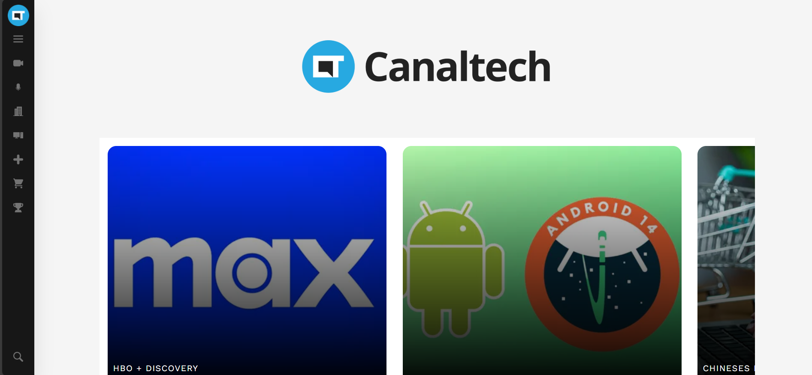
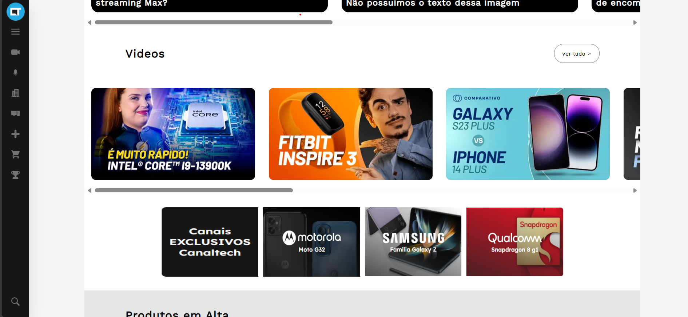
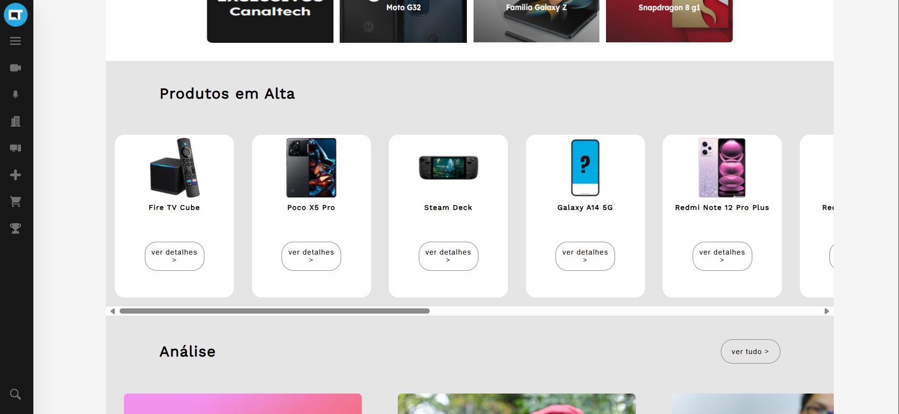
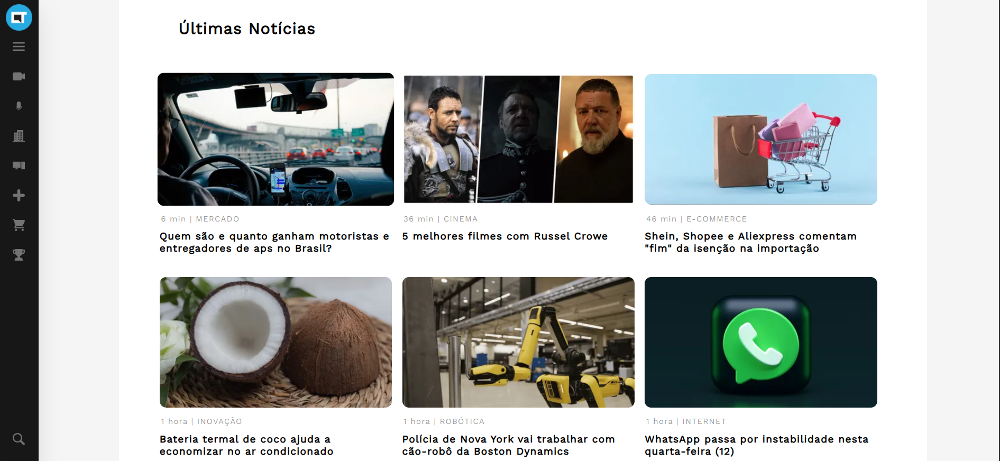
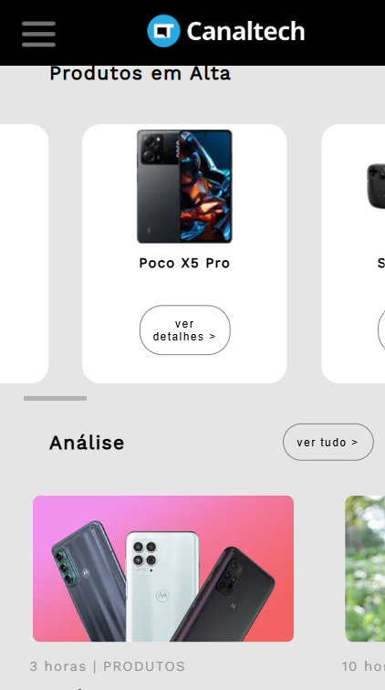
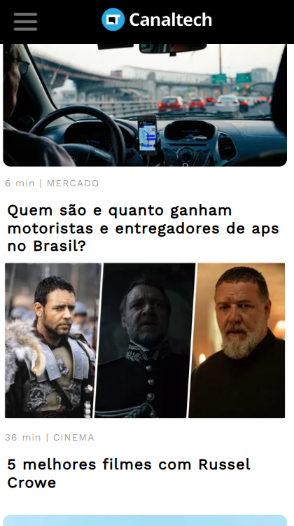

# Clone-Canaltech
Este projeto foi desenvolvido em 2023 como minha primeira atividade na disciplina de Programação Web durante o 1º semestre do curso técnico de Desenvolvimento de Sistemas. O objetivo do projeto foi recriar o visual do site do Canaltech, focando na estruturação correta do HTML e na estilização utilizando apenas CSS puro.

🚀 Tecnologias Utilizadas

HTML5

CSS3

📌 Objetivos do Projeto

Praticar a estruturação de páginas web utilizando HTML semântico.

Aprimorar habilidades em estilização com CSS puro.

Implementar um layout responsivo que se adapte a diferentes dispositivos.

Reproduzir fielmente a interface do site original.

## 🖼 Prévia do Projeto

Aqui estão algumas imagens do projeto:

### Versão Responsiva

 

